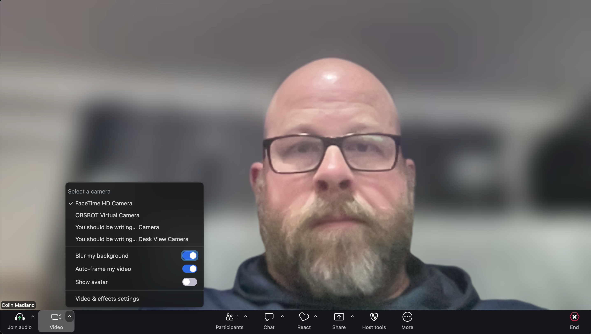
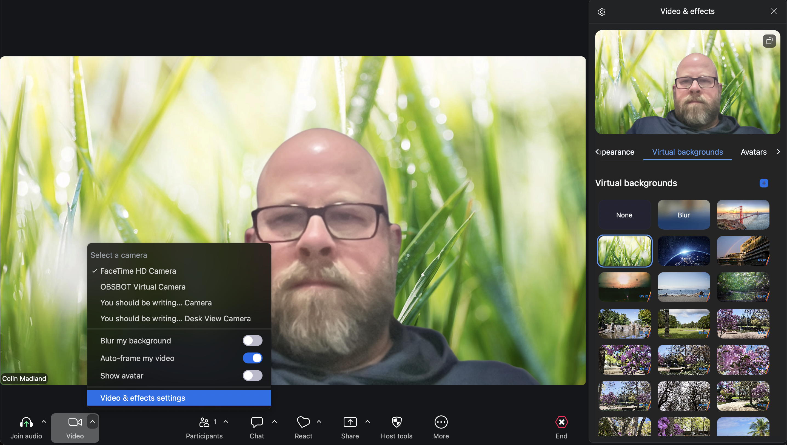
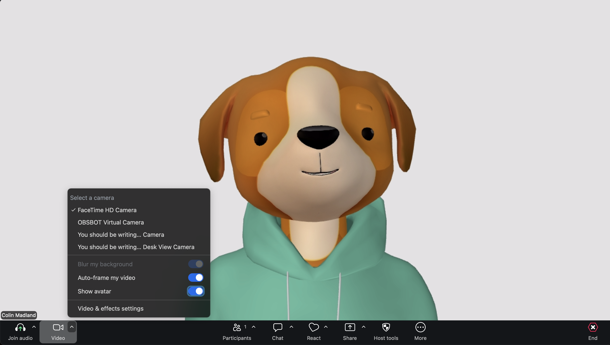
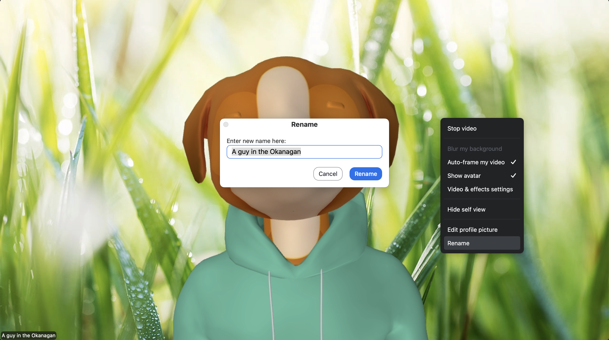
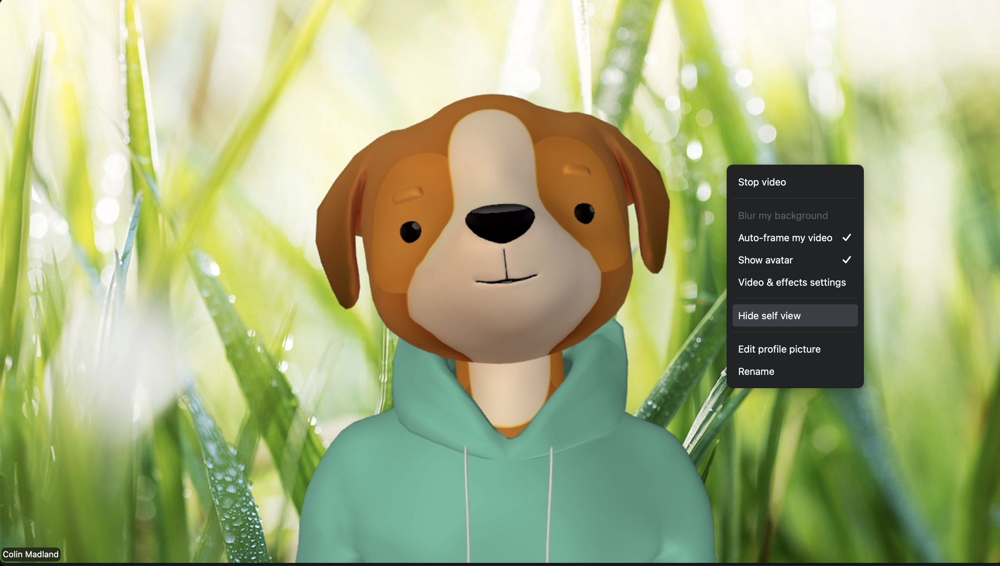
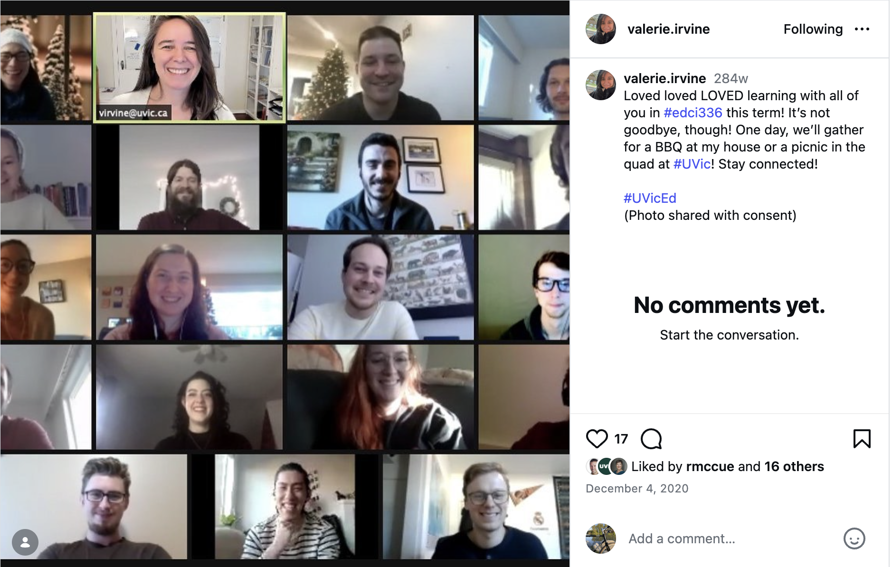

Hi Folks,

What follows isn't an attempt to guilt-trip you, but rather to try to come to provide some clarity about EDCI339 and why it is structured the way it is, and also to invite conversation about what you expect and want out of the course.

As I indicated in the Brightspace announcement, the department has let me know that attendance in Zoom is mandatory.

I have not taught a course in a few years, and I was a little taken aback during our first meeting. I have never taught a course where none of the participants had their camera on and so few people used the mic to share thoughts or opinions. Distributed and online learning has long had a negative reputation for being a very lonely and isolating experience, and EDCI339, where we are studying online learning, is specifically designed to build community. However, it is very difficult for this to occur if folks are not in the Zoom meetings, and if those who are there remain invisible.

[One of the foundational theories of distributed and online learning is the idea of a Community of Inquiry,](https://www.thecommunityofinquiry.org/framework) which recognizes three separate but interconnected 'presences' in high-quality online learning experiences. 

Social presence
: the ability of members of the community to project a sense of themselves and their personality into the community.

Cognitive presence
: the ability of community members to make sense of the content and ideas in the course through sustained communication.

Teaching presence
: the design and direction of cognitive and social presence to allow members to realize personally meaningful outcomes.

I am primarily responsible for promoting cognitive presence in the community, and you and I share responsibility for teaching presence. However, I can offer endless ways for you to bring social presence, but if you don't take the opportunity to step out and share something of yourself, the community will be impoverished, isolating, and lonely.

I recognize that there are some of you who live with anxiety and for whom participating in group activities is difficult, and I am happy to support you. Please reach out if this is you. There are several ways that you can fully or partially anonymize yourself in our meetings.

1. You may set your Zoom background to be blurred, or to display an image, thereby hiding what is happening behind you.  

::: {.columns}

::: {.column}

{fig-alt="Colin in a Zoom session with his background blurred. The image shows where to toggle the blur on or off in the bottom left corner of Zoom"}

:::

::: {.column}

{fig-alt="Colin in a Zoom session with an image of bright green grass replacing his background."}
:::

:::

2. You may set your video feed to display an avatar instead of your image.  

{fig-alt="Colin in a Zoom session with his video feed replaced by an avatar of a smiling dog wearing a green sweater."}

3. You may rename yourself in the Zoom session. 

{fig-alt="Colin in a Zoom session as a dog avatar with a green grass background showing how you can right-click on your video feed and choose 'Rename'."}

4. You may hide your own video feed so that it does not show up on your screen.

{fig-alt="Colin in a Zoom session showing how you can right-click on your video feed and choose 'Hide Self View.'"}

You can choose any or all of these strategies.

There are also those who desire to be less visible in group activities (me included). If this is you, please make an effort to speak out during the class, and also know that I use the Learning Pods to encourage connections among smaller groups of learners where it is less intimidating to be yourself.

In the end, taking this course without engaging in community-building experiences, even over Zoom, is like taking swimming lessons without ever getting in the water, or a math course without doing math.

I get it. Zoom isn't super personal and it is incredibly easy to fade into the background. I have been in many Zoom meetings while out for a bike ride with my video feed off and my mic muted, but those always cost me opportunities to connect and participate.

However, Zoom _can_ be a great way to build community, even though we are connecting through a screen. 

{fig-alt="Instagram post of a screenshot from Zoom showing a group of people smiling at the camera. The caption reads 'Loved loved LOVED learning with all of you in #edci336 this term! It’s not goodbye, though! One day, we’ll gather for a BBQ at my house or a picnic in the quad at #UVic! Stay connected! #UVicEd (Photo shared with consent)'"}

[Link to the original post, for however long it lasts.](https://www.instagram.com/p/CIZmGxWDNY45ECS5hALVsTJQpzkm6cQRU1lhNc0/)