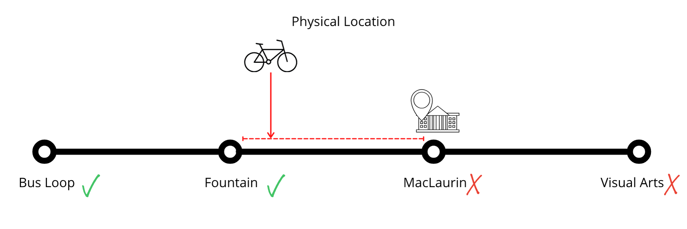
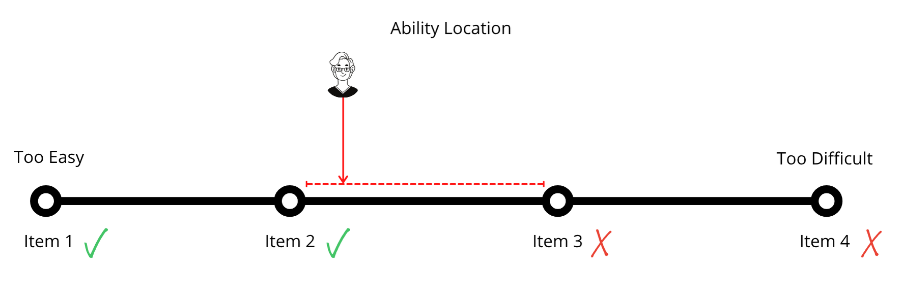

## Meeting Agenda - June 3

## Course Logistics

::: {.callout-important}

## Urgent

- Your [blog status](https://cmadland.github.io/edci339/posts/may-17/)  
- [Learner Pathways Survey](https://bright.uvic.ca/d2l/le/content/478290/viewContent/3846050/View)  
- [Learning Pod Sign-up](https://bright.uvic.ca/d2l/le/content/478290/viewContent/3845921/View)   
- Publish a blog post describing your inquiry topic. You only need one post per Learning Pod, but make sure there are links to each Learning Pod member's site in the post.
:::


::: {.callout}

## NEW

- Please publish on your blog your inquiry topic and the format you plan to use by **Sunday, May 31**.  
- Try to have 1-2 process posts related to your inquiry project by **Wednesday, June 3**.

:::


 
## Technology-Integrated Assessment


## Overview {.unnumbered}

In this unit, we will explore the nature of technology integrated assessment. In any formal learning environment, and many informal learning environments, there is a requirement for the instructor to engage in some sort of assessment of how well the learners are achieving the outcomes intended in the course design. Typically, this has happened with the assignment of a grade in a percentage or letter format, and usually accompanied by a significant amount of feedback from the instructor. In order to do this, the instructor needs to come to know what the learner knows, can do, or has become in relation to the outcomes. Coaching and facilitation are two activities that are highly dependent on assessing a learner's knowledge or ability in relation to a learning outcome and are key components of the process of certifying that a learner has achieved a certain level of proficiency. Knowledge of results occurs when an instructor or learner have identified a gap between what the learner is currently able to do and what they should be able to do in light of the course or program learning outcomes. Feedback occurs when information about how to close that gap is identified and the learner has the opportunity to improve their performance.

### Topics {.unnumbered}

This unit is divided into the following topics:

1. What is educational assessment?
2. What is wrong with educational assesment?
3. How does technology impact assessment?
4. Feedback Loops and Spirals


### Learning Activities {.unnumbered}

Here is a list of learning activities that will benefit you in completing this unit. You may find it useful for planning your work.

- Read 
  - Bower, M. (2019). [Technology‐mediated learning theory.](https://doi.org/10.1111/bjet.12771) *British Journal of Educational Technology, 50*(3), 1035–1048. 
  - Carless, D. (2019). [Feedback loops and the longer-term: Towards feedback spirals.](https://doi.org/10.1080/02602938.2018.1531108) *Assessment & Evaluation in Higher Education, 44*(5), 705–714.   
  - Lipnevich, A. A., Guskey, T. R., Murano, D. M., & Smith, J. K. (2020). [What do grades mean? Variation in grading criteria in American college and university courses.](https://doi.org/10/ghjw3k) _Assessment in Education: Principles, Policy & Practice, 27_(5), 480–500. 
  - Hattie, J., & Timperley, H. (2007). [The power of feedback.](https://doi.org/10.3102/003465430298487) _Review of Educational Research, 77_, 81–112. 


## What is Educational Assessment?

A key component of teaching in an educational environment is understanding how educators come to know what learners know. A teacher or peer can play the role of the more experienced 'other' that a learner needs to get them from the zone of not being able to complete a task, to being able to complete it with assistance in their zone of proximal development [@vygotskyMindSociety1978]. However, coming to know what learners know is not really a simple task because 'learning' and 'knowledge' are not things that we can see or measure. There are many things in our world that we can measure, like the mass of an apple, or the distance between two points, or the volume of an ingredient in a recipe. Knowledge is not like that, though, because it is encoded in the myriad connections between neurons in our brains. We can't examine a person's brain and determine what they know.

For example, if we want to know if a learner can calculate the following:

$$2+2=x$$

we cannot examine the physical properties of their brain to learn anything about whether they know how to calculate that sum. Instead, we must ask them to provide the answer. If they provide the following:

$$2+2=\text{apple}$$

we can then `infer` that they do not know how to calculate that sum. We can't be certain though, because they may have mistyped, or otherwise gotten confused about the task, or distracted because they were hungry. Conversely, if they respond with

$$2+2=4$$

We can `infer` that they do know how to calculate the sum, but again, _we can't be sure_. Perhaps they asked someone else, or used a calculator. The point is that we cannot truly `measure` a person's knowledge because knowledge of any given thing is `latent`, or not directly observable, and it is always subject to `error` ($\epsilon$).

Educational assessment can be framed as a trio of components that are essential to allowing instructors to learn what learners know. First, there must be some sort of _cognitive model or domain_ that is mapped and understood. In the case above, the cognitive domain might be `addition` as a mathematical procedure. Second, there must be some sort of _observation_ in the form of a performance task, like "calculate $2+2$". Third, there is always an _interpretation_ of the results of the performance task, the `inference` mentioned above.

These three components are interdependent and can be visualised as a triangle as below in @fig-triangle.

{#fig-triangle}

## Mapping the Domain

In formal learning settings, the domain is mapped out in the form of learning outcomes, sometimes also called learning targets or learning objectives. It is very likely that every course you have taken in higher ed has included several learning outcomes. Hopefully you recall the outcomes for this course. The learning outcomes for a course describe exactly what you, as a learner, should _know, be able to do, or have become_ after successful completion of the course. For example, the following is a possible learning outcome for a course:

:::note
On successful completion of this course, students should be able to:

Model metacognitive strategies for self-regulated learning.
:::

Notice that this is not describing an _activity_ in the course, but rather a description of some state of knowledge or being _after_ the course. Additionally, the outcome is (indirectly) observable. I'm not entirely comfortable with advising that outcomes be measurable, as we will see in the next section, but it is important that it is observable. An observable outcome (from the perspective of the instructor) should also be an outcome that can be operationalized (from the perspective of the learner). In other words, the learner will be able to use their new knowledge or ability in their life-context.

The verbs used in learning outcomes are important determinants of how observable or operationalizable is the outcome. For example, if the outcome noted above read 

:::note
"Describe metacognitive strategies for self-regulated learning."
:::

A simple question on a quiz or in a conversation that simply restates the outcome as a question will allow the instructor to observe whether or not the learner can describe strategies for metacognitive learning. However, operationalizing the ability to describe these strategies is less than inspiring. On the other hand, the ability to 'model' these strategies is perhaps more tricky for the instructor being able to observe the learner's ability, but it is highly relevant when operationalized in the learner's life.

- describe = low-level cognitive skill. 
- model = high level cognitive skill. 

## Observing Ability

The second component of the model is that of an `observation` of the learner's ability, or an assessment task of some sort. Assessment tasks can take a huge variety of forms and structures, often dictated by the cognitive domain addressed in the course. Examples include essays, exams, oral presentations, videos, dramatic productions, paintings, drawings, sculptures, journals, demonstrations, peer reviews, songs, poems, lab reports, worked examples, mathematic proofs, assessment conversations, revised drafts, websites, marketing campaigns, case studies, skills demonstrations, fitness tests, agility tests, concept maps, photographs...

::: {.callout-important}
The following demonstration may not work on mobile devices.
:::

```{r echo=FALSE}
#| label: wingdings
knitr::include_url("wingding.html")
```

You can likely see from the quiz on the middle slide that someone could answer the question correctly by simply matching a few patterns between the wingding content and the wingding quiz^[The correct answer is 'b'.], and not know anything at all about the actual content on the final slide. This means that a 'correct response' may not tell us anything at all about what a learner knows. So if our only method of determining the learner's ability is to ask them questions, but the questions can be correctly answered without knowledge, then our assessment strategy is not valid.

The instrument that an instructor uses to gather data about what learners know or can do is important, and unfortunately, the range of instruments commonly used is relatively limited. Many people may be able to recall their own undergrad experience with the final grade being determined by some combination of papers, midterms, and a final exam, with the weight of each increasing throughout the semester. However, as I mentioned in the previous paragraph, there are myriad different assessment task formats.

In a sense, it both matters deeply what assessment task you choose, and matters very little what assessment task you use. The important thing is that the assessment task allows you to gather `data` about what a learner knows, can do, or has become. Recall that the details of what a learner will know, be able to do, or become are specified in the learning outcomes and can be summarized in the word `ability`.

As long as the learning task is aligned with at least one learning outcome  [@biggsEnhancingTeachingConstructive1996], and can reasonably provide data about the learner's ability


We will think about what it means to make a valid inference in the next section. 

## Interpreting Assessment Data

As mentioned previously, a grade is not an absolute measurement of what a learner knows, can do, or has become. It is `always` an interpretation, or inference based on data that the learner provides.

### Inferring Location

Imagine you are giving someone directions to get from the Bus Loop on the UVic campus to the Visual Arts Building by bicycle. Your friend is late, and so you call them and ask them where they are.

- Are you past the Bus Loop?  
- Yes.  
- Havew you passed the fountain?  
- Yes. 
- Have you passed MacLaurin?
- No. 

Now you know that your friend is somewhere between the fountain and MacLaurin, but you don't know specifically where. you also know that they can't be at Visual Arts, because they haven't yet reached MacLaurin. This is illustrated in @fig-location

{#fig-location}

### Inferring Ability

This is analogous to what an instructor needs to do to assign a grade, or level of ability, to a learner. The instructor can ask a series of questions or assign a series of tasks of increasing difficulty.

- Can you do a difficulty level one task?  
- Yes. (The learner demonstrates their ability.). 
- Can you do a difficulty level two task?  
- Yes.  
- Can you do a difficulty level three task?  
- No.

This is illustrated in @fig-ability.

{#fig-ability}

After this series of tasks, the instructor can `infer` that the learner is somewhere between difficulty level two and three, and since they are below difficulty level three, they can't be at difficulty level four.

## What's Wrong with Educational Assessment?

One of the key problems with educational assessment is that higher ed instructors tend to have FAR more confidence in their assigned grades than is justified by the model described above. All we know is that any given learner is within a range of abilities, and without highly sophisticated adaptive exams like the NCLEX for Nurses, or the SAT, MCAT, LSAT, or other standardized tests in the US, that range is remarkable wide.

Research from Tom Guskey [@guskeyWhatWeKnow2019] suggests that the range, otherwise known as the margin of error is =/- 5-6%. That means that most higher ed faculty can really only be confident in placing your grade somewhere in a 10-12% range, like 63-75%, or 78-90%. You should be able to see that is a huge range when many instructors will quibble over 0.5% or less.

The reason for this is that a grade is the result of a simple equation shown in @eq-true-score.

$$X=T+e$${#eq-true-score}

Where
: $X$ = the learner's Observed Score
: $T$ = the learner's True Score, and
: $e$ = Error

### Class Activity

- breakout rooms. 
- [download this file](https://github.com/cmadland/edci339/blob/main/sample_gradebook_raw.xlsx)
